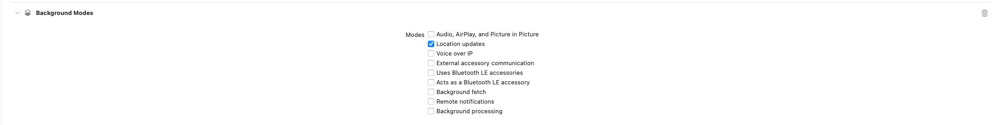

# Perimeter

This API provides a simple, straightforward, and robust way to do geofencing on iOS and Android. 

### Installing Perimeter

```bash
npm install @meld/perimeter
npx cap sync
```

### Declaring capabilities

Geofencing relies on the device to passively monitor the user's precise location in the background. Per Apple and Google guidelines, your app must declare that it needs this background location access and show a UI to help users understand why. On Android you must manually show this UI. 

#### iOS

On iOS, simply declare the capabilities:



Then add a description for the following property strings:

`Privacy - Location Always and When In Use Usage Description`

`Privacy - Location Always Usage Description`

`Privacy - Location When In Use Usage Description`

#### Android

1. Add the following to your AndroidManifest.xml:

```xml
<uses-feature android:name="android.hardware.location.gps" />
<uses-permission android:name="android.permission.ACCESS_FINE_LOCATION" />
<uses-permission android:name="android.permission.ACCESS_BACKGROUND_LOCATION" />

<receiver
    android:name="fyi.meld.perimeter.SimplePerimeterReceiver"
    android:enabled="true"
    android:exported="true">
</receiver>
```


### Requesting Permissions

#### iOS 12 or Android 9 and earlier

```javascript
async requestPerms() : Promise<void> {
      this.permStatus = await Perimeter.checkPermissions();
    if(this.permStatus.foreground != "granted" || this.permStatus.background != "granted") {
        this.permStatus = await Perimeter.requestPermissions();
    }
}
```

#### iOS 13 or Android 10 and later
```javascript
async requestPerms() : Promise<void> {
      this.permStatus = await Perimeter.checkPermissions();
    if(this.permStatus.foreground != "granted") {
        this.permStatus = await 	Perimeter.requestForegroundPermissions();
    }

	// Show your Android specific UI here.

    if (this.permStatus.background != "granted") {
        this.permStatus = await Perimeter.requestBackgroundPermissions();
    }
}
```

Before you call `requestBackgroundPermissions` on Android, show a dialog to help users understand why the app needs their background location. **If you do not show this dialog, your app may be rejected in review.** For more information, see the following [developer docs.](https://developer.android.com/training/location/permissions#background-dialog-target-android-11)

### Setting up a fence

Start by setting up a listener for a `FenceEvent`:

```javascript
Perimeter.addListener("FenceEvent", (fenceEvent) => { 
    console.log(fenceEvent.fence.payload) 
});
```

Next, create a `Fence` object covering a given region.

```javascript
let extraData = "I want to visit this place someday.";
let newFence : Fence = {
    name : "Taj Mahal",
    uid : '123456789',
    payload: extraData,
    lat : 27.1751,
    lng : 78.0421,
    radius : 200, 
    monitor : TransitionType.Enter
};

Perimeter.addFence(newFence).then(() => {
    this.activeFences.push(newFence);
})
    .catch((e) => {
    console.log(e);
});
```

The name, UID, latitude, and longitude fields are self explanatory. For the other fields:

* `payload`: A extra field containing `String` data that you can use. It will be delivered back to you when a `FenceEvent` is triggered.
* `radius`: The radius of the circular region to be monitored in meters. Across iOS and Android the minimum is 100m.
* `monitor`: Specify the `TransitionType` that will trigger a `FenceEvent`.

Finally, call `addFence(newFence)` to begin monitoring the region.

When the user enters and/or exits the region, you'll get a `FenceEvent` that looks something like this:
```javascript
FenceEvent {
    fences : 'A list of fences that were triggered by a given action',
    time : 'Trigger time in milliseconds',
    transitionType : 'The type of action that triggered this event (enter or exit)'
};
```

### Other important information
* Geofences are cleared on boot or app uninstallation on Android.

Copyright Mark Raymond Jr., All Rights Reserved. 2022
